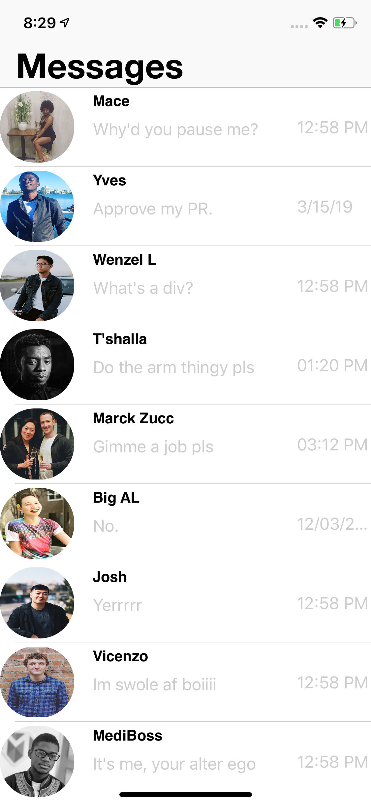

# UI

This project contains a series of popular ios apps clones to level up my design skills in ios with AutoLayout.

## Project 1 - Apple's iMessage(UIKit)
</img>

### Technologies

* Swift 4.2
* AutoLayout
* UIKit

### Lesson Learned

* Lazy loading ui elements
* Using the width and eight anchor with multipliers insteas of leading, trailing, top, bottom for stack view subviews.

## Project 2 - Twitter
## Project 3 - Apple Music
## Project 4 - Gmail
